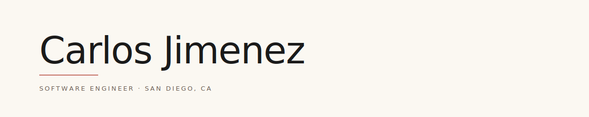

<picture>
  <source media="(prefers-color-scheme: dark)" srcset=".github/banner-dark.svg">
  
</picture>

Mission-critical apps for the **San Diego Fire Department**. Personal work in Rust and Python.

## Projects

*All private — descriptions only.*

| Project | Stack | What it does |
|---|---|---|
| **CADSOS** | Flutter · Dart · RabbitMQ · SQL Server · Riverpod | Live incident-tracking app for SDFD with ArcGIS map layers. RPC-style messaging, real-time streams, built for restricted offline networks. |
| **Special Status Queue** | Flutter · Dart · Python · C# · RabbitMQ · SQL Server | Out-of-service unit tracking for SDFD dispatchers and field crews. |
| **TorchDocTool** | React · JavaScript · SQL Server | Browser-based schema documentation — attaches metadata to SQL Server tables and columns via extended properties. |
| **Aircraft Order** | Flutter · Python · C# / .NET · SQL Server | Cross-language ordering workflow: Flutter UI → Python service → C# / .NET data layer, logged to SQL Server. |
| **Interface Restart Automation** | Python · PsExec · schtasks | Maps logical interface names to host servers and triggers remote scheduled-task restarts. |
| **Junbi** | Rust · Tauri · JavaScript | Cross-platform desktop app built on Tauri. |
| **swingscanner** | Python · PowerShell · HTML | Swing-trade screener with HTML reports and Windows-side automation. |

[LinkedIn](https://www.linkedin.com/in/jimenezcarlos-/) · [Email](mailto:carlosjimenez.eng@gmail.com)

<!--
ca-jimen/ca-jimen is a ✨ special ✨ repository because its `README.md` (this file) appears on your GitHub profile.
-->
